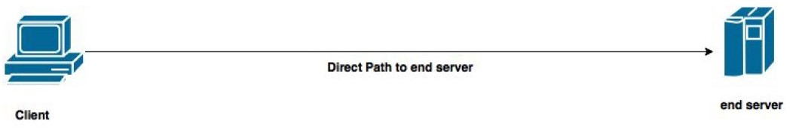
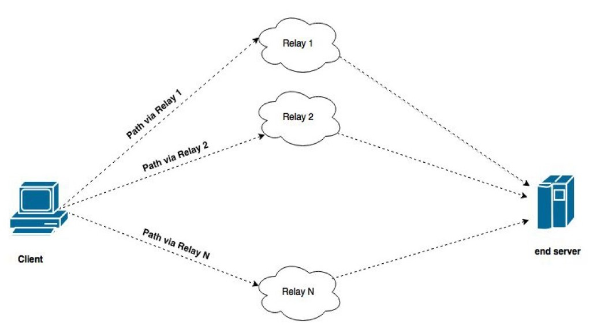

# Virtual private overlay network
 Virtual private overlay network is a Python developed short anonymous network.


## Features
This network can:
* Hide the client's IP address from the server using a proxy
* Find the best path based on the round trip time or the number of hops using relays
* Offer a GUI environment for the user
* Support two modes: 
  * the direct mode (no proxy needed) 
    
  * the relay mode (relays included)
    


## Configuration
The client reads 2 files as shown above the list of end servers and the list of relays:
```python
    python client.py -e end_servers.txt -r relay_nodes.txt
```
then the client makes connection with the end server of his choice running the command:
```python
    endserver1 120 latency
```
